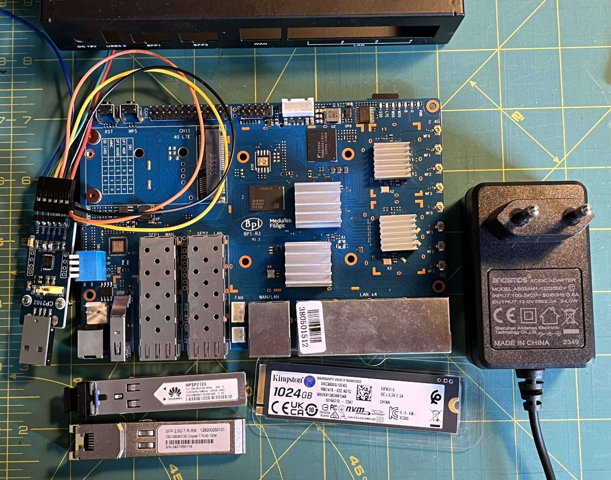
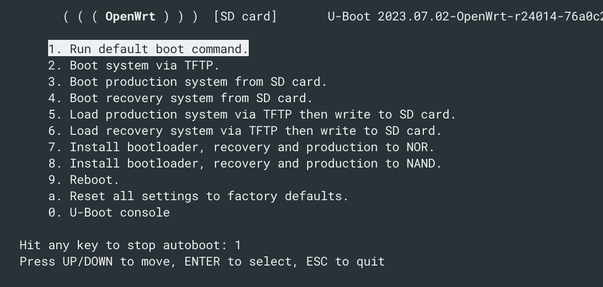

# Banana Pi

Stack:

- MediaTek MT7986 Quad Core Processor Motherboard 2G DDR4 RAM 8G eMMC Flash Electronic Control Board Smart Router - [link][board]
- UART
- SFP GPON
- SFP RJ45
- HDD SSD NVMe M.2




## Connection

### USB-UART converter
Set jumper to 3V
- `GND` black
- board `RX` orange -> converter `TXD` 
- board `TX` yellow -> converter `RXD`

### SFP
- `SFP1` WAN <- GPON ONU
- `SFP2` LAN <- RJ45 <- NAS


## TODO

- [ ] 2.5G
- [ ] GPON
- [ ] boot from eMMC
- [ ] HDD PCIe NVMe M.2


## Boot

### use UART interface to login

```sh
minicom -D /dev/tty.usbserial-0001
```
Firstboot
```sh
 ----------------------------------------------------
 | OpenWrt 23.05-SNAPSHOT, r23780-6f70e09a00        |
 | Build time: 2024-03-09 13:45 CET                 |
 | Cezary Jackiewicz, https://eko.one.pl            |
 ----------------------------------------------------
 | Machine: Bananapi BPI-R3                         |
 | Uptime: 0d, 00:01:18                             |
 | Load: 0.35 0.15 0.06                             |
 | Flash: total: 88.3MB, free: 51.4MB, used: 42%    |
 | Memory: total: 1.9GB, free: 1.9GB, used: 4%      |
 | Leases: 0                                        |
 | lan: static, 192.168.10.1                        |
 | wan: dhcp, ?                                     |
 | wan6: dhcpv6, ?                                  |
 ----------------------------------------------------

root@OpenWrt:/# df -h
Filesystem                Size      Used Available Use% Mounted on
/dev/root                 8.8M      8.8M         0 100% /rom
tmpfs                   996.8M    880.0K    995.9M   0% /tmp
/dev/mmcblk0p66          88.3M     37.0M     51.4M  42% /overlay
overlayfs:/overlay       88.3M     37.0M     51.4M  42% /
tmpfs                   512.0K         0    512.0K   0% /dev
```
Updated image
```sh
----------------------------------------------------
 | OpenWrt 23.05-SNAPSHOT, r24014-76a0c2932c        |
 | Build time: 2024-07-20 09:42 CEST                |
 | Cezary Jackiewicz, https://eko.one.pl            |
 ----------------------------------------------------
 | Machine: Bananapi BPI-R3                         |
 | Uptime: 0d, 00:01:28                             |
 | Load: 0.02 0.01 0.00                             |
 | Flash:                                           |
 | Memory: total: 1.9GB, free: 1.9GB, used: 4%      |
 | Leases: 0                                        |
 | lan: static, 192.168.1.1                         |
 | wan: dhcp, ?                                     |
 | wan6: dhcpv6, ?                                  |
 ----------------------------------------------------
```
Do not touch the keys :smile:


This (initramfs only) was probably the cause of the above effect.
```sh
root@OpenWrt:/# df -h
Filesystem                Size      Used Available Use% Mounted on
tmpfs                   996.8M     25.7M    971.1M   3% /
tmpfs                   996.8M    860.0K    996.0M   0% /tmp
tmpfs                   512.0K         0    512.0K   0% /dev
```

Now looks good
```sh
root@OpenWrt:/# df -h
Filesystem                Size      Used Available Use% Mounted on
/dev/root                 8.8M      8.8M         0 100% /rom
tmpfs                   996.8M   1008.0K    995.8M   0% /tmp
/dev/mmcblk0p66          88.3M     36.5M     51.8M  41% /overlay
overlayfs:/overlay       88.3M     36.5M     51.8M  41% /
tmpfs                   512.0K         0    512.0K   0% /dev
```

## Configure

### Network (temporary ethernet wan port)

Insert `SFP RJ45` connector into the SFP2.

```sh
# root@OpenWrt:/# 
vi /etc/config/network
```
Move **temporarily** `list ports 'sfp2'` to `config device | option name 'br-wan'` section. Then `/etc/init.d/network restart`

#### Access to Luci from wan port (it is local network)

```sh
uci add firewall rule
uci set firewall.@rule[-1]._name=luciWAN
uci set firewall.@rule[-1].src=wan
uci set firewall.@rule[-1].src_ip=192.168.101.12
uci set firewall.@rule[-1].target=ACCEPT
uci set firewall.@rule[-1].proto=tcp
uci set firewall.@rule[-1].dest_port=80

uci commit firewall   # write changes to /etc/config/firewall
/etc/init.d/firewall restart
```

Use a Sysupgrade image to update a router that already runs OpenWrt. The image can be used with the LuCI web interface or the terminal.

```
Using ethernet@15100000 device
TFTP from server 192.168.1.254; our IP address is 192.168.1.1
Filename 'openwrt-mediatek-filogic-bananapi_bpi-r3-initramfs-recovery.itb'.
Load address: 0x46000000
Loading: *
ARP Retry count exceeded; starting again
Wrong Image Format for bootm command
ERROR: can't get kernel image!
```

### SSH
- add a key
  ```sh
  cat > /etc/dropbear/authorized_keys  # ssh-copy-id doesn't work for now
  ```
- disable SSH password authentication
  ```sh
  uci show dropbear
  uci set dropbear.@dropbear[0].PasswordAuth='on'
  uci commit dropbear
  service dropbear restart
  ```

### Tools

```sh
# root@OpenWrt:/# 
opkg update

opkg install lsblk pciutils ethtool vim
```


## Links

- [wiki banana-pi](https://wiki.banana-pi.org/Getting_Started_with_BPI-R3)
- [wiki junicast](https://wiki.junicast.de/en/junicast/review/bananapi-BPI-R3)
- [firmware](https://dl.eko.one.pl/firmware/?version=luci-23.05-SNAPSHOT&target=mediatek%2Ffilogic&id=bananapi_bpi-r3)
- [Rafał Bielawski @YouTube](https://www.youtube.com/watch?v=PmTMmande14)
- [Accessing LuCI web interface securely](https://openwrt.org/docs/guide-user/luci/luci.secure)

[board]: https://pl.aliexpress.com/item/1005004886608696.html?spm=a2g0o.order_list.order_list_main.5.43e91c24iRBFf1&gatewayAdapt=glo2pol
[OpenWrt config]: https://openwrt.org/docs/guide-user/base-system/start
